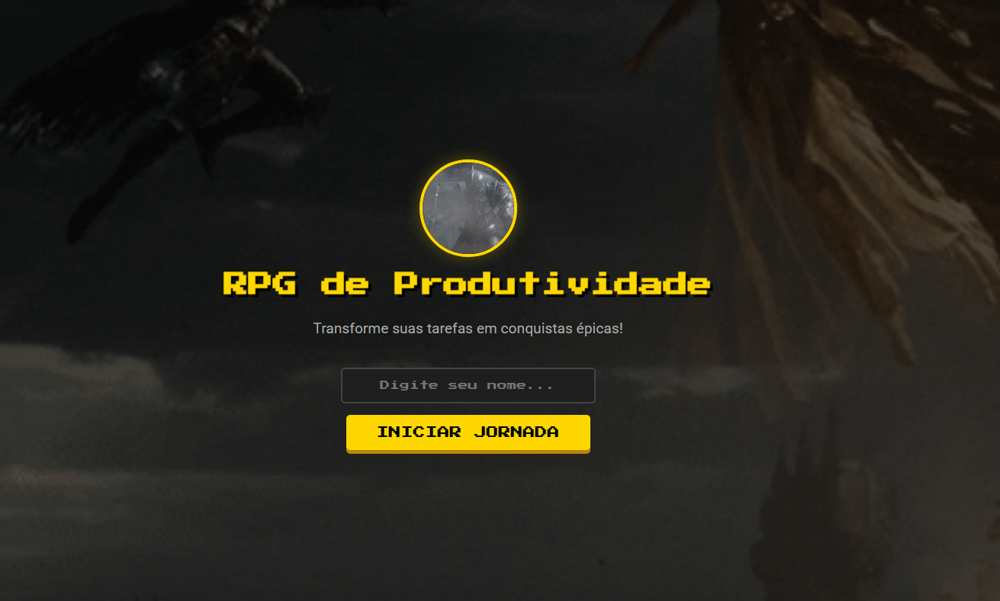
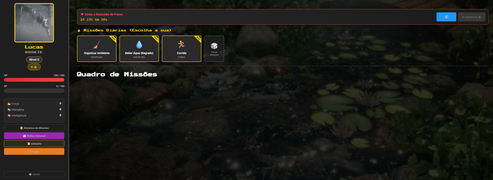
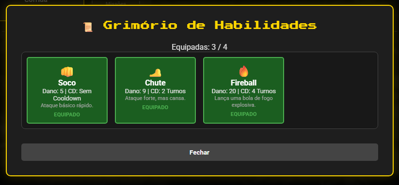

# ⚔️ RPG de Produtividade (v1.0-BETA)

> **"Não é apenas sobre fazer tarefas, é sobre evoluir seu personagem na vida real."**

O **RPG de Produtividade** é uma aplicação web gamificada projetada para combater a procrastinação. Ele transforma suas tarefas diárias, estudos e treinos em missões que concedem experiência (XP), ouro e níveis para seu personagem.


---

## 📸 Capturas de Tela (Screenshots)

> *Desenvolvedor: Substitua os caminhos das imagens abaixo pelos prints reais do seu projeto na pasta assets/screenshots!*

### 🚀 Início da Jornada (Login)
A tela inicial (`index.html`) onde o herói digita seu nome para criar o save local e iniciar a aventura.


### 🏠 Painel Principal
Onde você gerencia suas missões, vê seu nível e atributos.


### ⚔️ Sistema de Combate (Boss Semanal)
Todo fim de semana, um Chefe aparece. Use as habilidades que você comprou para derrotá-lo!


### 🛒 Loja e Grimório
Gaste seu ouro suado para comprar novas técnicas como "Bola de Fogo" ou "Kamehameha".


---

## 🚀 Funcionalidades Principais

### 1. Sistema de Missões e Rotina
- **Missões Avulsas:** Adicione tarefas rápidas do dia a dia.
- **Rotina Semanal:** Configure tarefas que se repetem automaticamente (ex: "Academia" toda Segunda e Quarta).
- **Categorias:** Cada tarefa fortalece um atributo específico:
    - 💪 **Força:** Exercícios, saúde física.
    - 🧠 **Inteligência:** Estudos, trabalho, leitura.
    - 📚 **Disciplina:** Organização, meditação, tarefas domésticas.

### 2. Gamificação Real
- **XP e Nível:** Suba de nível para desbloquear novas mecânicas.
- **Economia (Ouro):** Complete tarefas para ganhar ouro.
- **HP (Vida):** Se você não completar uma tarefa em 24h ou desistir dela, você perde vida! Se seu HP chegar a 0, punições podem ocorrer.

### 3. Sistema de Batalha (Boss Battles)
- **Chefes:** Inimigos como "Zoran, o Destruidor de Prazos" aparecem nos fins de semana.
- **Combate por Turnos:** Um sistema completo de RPG inspirado em jogos clássicos.
- **Visual:** Animações CSS de projéteis, raios de energia (Kamehameha) e feedback de dano.
- **Habilidades:** Use o ouro ganho na semana para comprar habilidades na *Loja* e equipá-las no *Grimório*.

---

## 🛠️ Tecnologias Utilizadas

Este projeto foi desenvolvido com foco em fundamentos sólidos de desenvolvimento web, sem o uso de frameworks pesados, garantindo performance máxima e aprendizado profundo de lógica.

- **HTML5:** Estruturação semântica.
- **CSS3:** Animações avançadas (`keyframes`), Flexbox e Grid Layout.
- **JavaScript (Vanilla):**
    - Lógica de Jogo (Game Loop, State Management).
    - Manipulação de DOM em tempo real.
    - **LocalStorage:** Todo o seu progresso é salvo automaticamente no seu navegador. Não requer login nem internet!

---

## 📂 Estrutura do Projeto

```
RPG-de-Produtividade/
├── index.html          # Tela de Login/Boas-vindas
├── main.html           # Aplicação Principal (Dashboard)
├── style.css           # Estilos Globais e Tema Dark
├── combat_anim.css     # Motor de Animações de Batalha
├── routine_styles.css  # Estilos do Modal de Rotina
├── skills.js           # Banco de Dados de Habilidades
├── monsters.js         # Banco de Dados de Monstros
├── info/               # Documentação e Tutoriais
└── assets/             # Imagens e Efeitos Visuais
```

---

## 🎮 Como Jogar / Instalar

1. **Clone este repositório:**
   ```bash
   git clone https://github.com/SEU-USUARIO/RPG-de-Produtividade.git
   ```
2. **Abra o arquivo:**
   Basta abrir o arquivo `index.html` em qualquer navegador moderno (Chrome, Firefox, Edge).
   
   *Não é necessário instalar Node.js, Python ou servidores. É 100% Client-Side.*

---

## 🔮 Futuro do Projeto (Roadmap)

- [ ] Adicionar mais Bosses e Inimigos comuns.
- [ ] Sistema de Classes (Mago, Guerreiro, Ladino) com sprites únicos.
- [ ] Efeitos sonoros para ações e combate.
- [ ] Versão Mobile (PWA) para instalar no celular.

---

## 📄 Licença

Este projeto é de código aberto. Sinta-se à vontade para contribuir, fazer forks ou usar para organizar sua própria vida!

Criado com ❤️ por Lucas César Lorena

